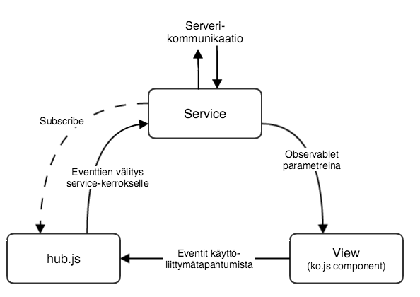
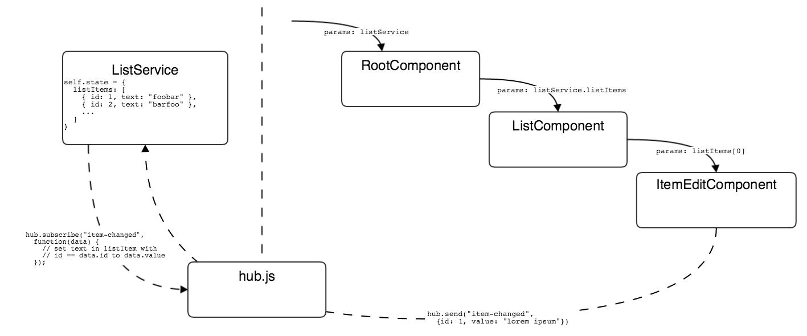

# Kehitystyö

## Ympäristön pystytys

Tarvitset kehitysympäristöön seuraavat työkalut:

- [JDK 8](http://www.oracle.com/technetwork/java/javase/downloads/index.html)
- [Leiningen](https://github.com/technomancy/leiningen) 2.5+
- [MongoDB](https://www.mongodb.org/downloads) (testattu 2.6 - 3.2 versioilla)
    - Mac: `brew install mongodb` (`brew tap homebrew/services` + `brew services start mongodb`)
    - Tarkista, että mongon kantakansiolla ja lokikansiolla on asetettu permissionit
    - Macillä saattaa tulla avoimien tiedostojen raja vastaan: [How to persist ulimit settings in osx](http://unix.stackexchange.com/questions/108174/how-to-persist-ulimit-settings-in-osx-mavericks)
- CSS ja [Sass](http://sass-lang.com):
    - [Ruby](https://www.ruby-lang.org)
    - [Compass](http://compass-style.org/): `gem install compass`
    - [Node.js](https://nodejs.org)
    - [Bless](http://blesscss.com): `npm install bless@3.0.3 -g`
- Python 2.x ja [Robot Framework](http://robotframework.org/) selaintestausta varten
  - `pip install robotframework`
  - `pip install robotframework-selenium2library`
  - IE:llä ajettavia testejä varten ajuri osoitteesta  http://selenium-release.storage.googleapis.com/index.html
  - Chromella ajettavia testejä varten ajuri osoitteesta http://chromedriver.storage.googleapis.com/index.html
- [pdftk](https://www.pdflabs.com/tools/pdftk-server/)
  PDF-tiedostojen kääntämistä ja korjaamista varten. [Apuja OS X -ongelmiin](http://stackoverflow.com/questions/32505951/pdftk-server-on-os-x-10-11)

Valinnaisesti:

- [pdf2pdf](https://www.pdf-tools.com/pdf/Products-Shop/Evaluate.aspx?p=CNV&back=%2fpdf%2fpdf-to-pdfa-converter-signature.aspx)
  PDF/A-konversioita varten
- [KnockoutJS context debugger](https://chrome.google.com/webstore/detail/knockoutjs-context-debugg/oddcpmchholgcjgjdnfjmildmlielhof) Chrome plugin, joka helpottaa DOM-elementtien binding kontekstien hahmottamista

## Kehitysympäristön konfigurointi

### user.properties

Luo projektin juureen (sovelluksen kehitysaikaiseen ajohakemistoon)
user.properties -tiedosto. Tiedostossa voit määritellä
mm. tietokantayhteyden:

    mongodb.servers.0.host  localhost
    mongodb.servers.0.port  27017
    mongodb.dbname          lupapiste
    mongodb.credentials.username     lupapiste-kannan-user
    mongodb.credentials.password     lupapiste-kannan-salasana

Jos haluat pdf2pdf työkalun käyttöön, määrittele lisenssiavain lisäämällä tiedostoon

    pdf2pdf.license-key    AVAIMESI


### Master password

Sovellus vaatii käynnistyäkseen master-salasanan asettamisen. Salasanan voi
asettaa
- tallentamalla se kotihakemistosi application_master_password.txt tiedostoon
- `APPLICATION_MASTER_PASSWORD` ympäristömuuttujassa tai
-  `-Dapplication.masterpassword=xxxx` käynnistysparametrilla
  (kun sovellus käynnistetään java -jar komennolla).

Salasanaa käytetään asetuksissa olevien salaisuuksien avaamiseen (ja kryptaamiseen).
Properties-tiedostoissa voi käyttää Jasyptilla kryptattuja arvoja, ks. ohje
test/lupapalvelu/nested.properties tiedostossa.

### SSL-avain

Kehitysmoodissa Lupapiste-sovelluksen sisäänrakennettu sovelluspalvelin kuuntelee
HTTPS-liikennettä portissa 8443. Generoi tätä varten projektin juureen
SSL/TLS-avain keystore -nimiseen tiedostoon. Keystoren salasanan oletetaan
olevan "lupapiste". Portin, keystore-tiedoston nimen  ja salasanan voi
ylikirjoittaa user.properties tiedostossa.

Avaimen voi generoida esimerkiksi JDK:n mukana tulevalla keytool työkalulla seuraavasti:

    $ keytool -keystore keystore -alias jetty -genkey -keyalg RSA -sigalg SHA256withRSA

    Enter keystore password:  lupapiste
    Re-enter new password: lupapiste
    What is your first and last name?
      [Unknown]:  localhost
    What is the name of your organizational unit?
      [Unknown]:  kehitys
    What is the name of your organization?
      [Unknown]:  lupapiste
    What is the name of your City or Locality?
      [Unknown]:  Tampere
    What is the name of your State or Province?
      [Unknown]:  Finland
    What is the two-letter country code for this unit?
      [Unknown]:  fi
    Is CN=localhost, OU=kehitys, O=lupapiste, L=Tampere, ST=Finland, C=fi correct?
      [no]:  yes
    Enter key password for <jetty>
            (RETURN if same as keystore password):

Vaihtoehtoisesti voit lisätä user.properties tiedostoon rivin

    ssl.enabled    false

Tällöin sovelluspalvelin kuuntelee ainoastaan HTTP-liikennettä.

### Kartat ja paikkatietoaineisto

Karttojen ja paikkatietoaineiston käyttö vaatii käyttäjätunnukset Maanmittauslaitokselta.

Kartan saa testaustapauksissa toimimaan käyttämällä Maanmittauslaitoksen avointa [palvelualustaa](http://www.maanmittauslaitos.fi/aineistot-palvelut/rajapintapalvelut/paikkatiedon-palvelualustan-pilotti).
Tesitkäyttö onnistuu asettamalla user.properties tiedostoon seuraava rivi:

    maps.open-nls-wmts   http://avoindata.maanmittauslaitos.fi/mapcache/wmts

Tällöin selainpään karttakutsut lähetetään ko. karttapalvelimelle.

[Maanmittauslaitoksen avoimen datan lisenssi (CC 4.0)](http://www.maanmittauslaitos.fi/avoimen-tietoaineiston-cc-40-lisenssi)

Palvelun käyttämiä kiinteistö- ja osoitetietorajapintoja ei ole saatavina avoimina palveluina, lisätietoa rajapinnoista [Maanmittauslaitoksen](http://www.maanmittauslaitos.fi/aineistot-palvelut/rajapintapalvelut) sivuilta.


## Palvelun käynnistys

Kun työkalut on asennettu ja lisätty polkuun sekä MongoDB käynnistetty,
Lupapiste käynnistyy komennolla:

    lein run

Sovellus on ajossa osoitteessa http://localhost:8000.

Klikkaa oikean reunan Development-palkissa "Apply minimal" linkkiä.
Tämä alustaa tietokantaan muutamia käyttäjiä ja organisaatioita (kts. _minimal.clj_). Voit kirjautua
sisään esimerkiksi hakijatunnuksella pena/pena tai viranomaistunnuksella sonja/sonja.

Kirjautumisen jälkeen voit luoda hakemuksia ja neuvontapyyntöjä Tee hakemus- ja
Kysy neuvoa -painikkeilla. Voit myös käyttää Development-palkin linkkejä luodaksesi
hakemuksia yhdellä klikkauksella.

Palvelun käyttäjäohje löytyy osoitteessa https://www.lupapiste.fi/ohjeet/.

## Lähdekoodin hakemistorakenne

Koodi on jaoteltu seuraavasti:

Hakmisto          | Selitys
--------------    |----------
src               | Palvelinpään sovelluskoodi
src/lupapalvelu   | Erityisesti Lupapisteeseen liittyvä palvelinpään sovelluskoodi
src/sade          | Palvelinpään sovelluskoodi, jota on hyödynnetty muissa SADe-hankkeen projekteissa
resources         | Staattiset resurssit
resources/public  | Resurssit, jotka palvellaan automaattesesti palvelimen juuripolussa
resources/private | Selainpään sovelluskoodi
dev-resources     | Kehitys- ja testausaikaiset aputiedostot
dev-src           | Kehitysaikainen apulähdekoodi
test              | Palvelinpään yksikkötestit
itest             | Palvelinpään integraatiotestit
stest             | Palvelinpään systeemitestit
test-utils        | Palvelinpään testien jaettu koodi
robot             | Selainpään end-to-end-testi

Palvelinpään päätiedosto, josta ohjelmiston suoritus käynnistyy, on
src/lupapalvelu/main.clj.

## Tyylikäytännöt

Lähdekoodissa käytetään aina unix-rivinvaihtoja (`\n`).

Sisennys on kaksi välilyöntiä. Merkkijonojen ympärillä käytetään lainausmerkkejä
myös JavaScript-koodissa.

JavaScript-koodi tulee tarkastaa JSHint-työkalulla, jonka asetukset ovat projektin juuressa.

Clojure-koodissa käytetään seuraavia aliaksia nimiavaruuksille:

namespace                 | alias
--------------------------|-------
lupapalvelu.action        | action
lupapalvelu.application   | app
lupapalvelu.attachment    | att
lupapalvelu.authorization | auth
lupapalvelu.company       | com
lupapalvelu.domain        | domain
lupapalvelu.operations    | op
lupapalvelu.organization  | org
lupapalvelu.user          | usr
sade.env                  | env
sade.strings              | ss
sade.util                 | util

Nimiavaruuksiin viitataan aina :require tyylillä (:use avainsanaa ei käytetä).
Koko nimiavaruuden sisällyttämistä (`:require [lupapalvelu.namespace :refer :all]`)
tulee välttää. Poikkeustapauksia ovat mm. `sade.core` ja `monger.operators`.

## Versionhallinta

Kehitys tehdään develop-haaraan git flow -mallin mukaisesti. Tuotannossa on master-haara.

## Testaus

### Backend

 - `lein nitpicker` tekee lähdekooditiedostoille laittomien merkkien tarkastuksen
 - `lein midje` ajaa (pelkät) yksikkötestit
 - `lein integration` ajaa integraatiotestit. Integraatiotestit olettavat,
    että palvelin on käynnissä oletusportissa 8000 ja siitä on yhteys MML:n rajapintoihin.
 - `lein stest` ajaa systeemitestit, jotka käyttävät myös muita ulkoisia integraatioita.
 - `lein verify` ajaa kaikki edellä mainitut.

### Frontend end-to-end testit

 - `local.sh` / `local.bat` ajaa Robot Frameworkilla paikalliset testit.
   Näissä oletetaan, että  palvelin on käynnissä oletusportissa.
 - `local-integration.sh` / `local-integration.bat`
   ajaa Robot Frameworkilla testit, jotka käyttävät ulkoisia palveluita kuten
   VETUMA-kirjautumispalvelun testijärjestelmää.

Muista käyttää kahta välilyöntiä .robot-tiedostoissa erottamaan avainsanaa ja parametreja!

# Korkean tason domain-kuvaus

Ks. [tietomalli](information-architecture.md)

# Arkkitehtuuri yleiskuvaus

Asiointisovellus on toteutettu HTML5 Single-page application-pohjaisesti.
Käyttöliittymäkerros kutsuu taustapalvelua, joka edelleen lukee ja muokkaa
tietokannan tietoja. Järjestelmä tietosisältö muodostuu hakemuksista, niiden
lomaketiedoista ja liitetiedostoista sekä käyttäjistä. Rakenteisen tiedon osalta
pääroolissa ovat hakemuksen lomaketiedot, joten sovelluksen käyttöön on valittu
dokumenttitietokanta, johon monimuotoiset lomakkeet on helppo mallintaa.

Sovellus on toteutettu Command Query Responsibility Segregation periaatteiden
mukaisesti. Commandeja käytetään komentojen suorittamiseen (tiedon muokkaamiseen) ja
Queryjä käytetään tiedon kyselemiseen. Frontendistä kutsutaan backendin tarjoamia
JSON rajapintoja (*/api/command/<nimi>* (POST metodi) ja */api/query/<nimi>*
(GET metodi)).

## Keskeisimmät teknologiat

Frontend:
- [KnockoutJS](http://knockoutjs.com/documentation/introduction.html)
- [jQuery](http://api.jquery.com/)
- [lo-dash](http://lodash.com/)

Backend:
- [Clojure](http://clojure.org/)
- [MongoDB](http://docs.mongodb.org/)

# Frontend arkkitehtuuri

## Single Page kompositio

[web.clj](../src/lupapalvelu/web.clj)-tiedostossa määritellään rajapinnat,
jotka tarjoilevat kullekin [käyttäroolille](information-architecture.md#käyttäjä)
omat HTML-sovellussivut ja nihin liittyvät yhteenpaketoidut JavaScript- ja
CSS-resurssit. lupapalvelu.web nimiavaruudessa määritellään kullekin resurssille
pääsyrajaus, eli mikä käyttäjärooli vaaditaan.

Resurssien kompositio määritellään [ui_components.clj](../src/lupapalvelu/components/ui_components.clj)
-tiedostossa. Kutakin käyttäjien perusroolia vastaa oma komponentti,
jonka `:depends` vektoriin määritellään komponentit, joista tämä paketoitava resurssi koostuu.

Jokaista komponenttia vastaa alihakemisto [resources/private:ssa](../resources/private).
`:js`, `:css` ja `:html` avaimilla määritellään lista tiedostonimiä, joiden
tulee löytyä komponentin hakemistosta. Hakemiston nimen voi myös ylikirjoittaa
`:name` avaimen avulla.

HTML-tiedostoista poimitaan pelkät nav ja footer elementit sekä section class=page,
div class=notification ja script class=ko-template -elementit
(ks. [singlepage/parse-html-resource](../src/lupapalvelu/singlepage.clj)).

`ui-components`-niminen komponentti ja alihakemisto käsitellään erityisesti:
hakemiston kaikki tiedostot tulevat automaattisesti mukaan tähän komponenttiin.
_Huom:_ jotta uusi tiedosto tulee mukaan kehitysympäristössä,
lupapalvelu.components.ui-components nimiavaruus on ladattava uudelleen REPL:issä.
(Vaihtoehtoinen, raskaampa tapa saada muutokset voimaan on käynnistää palvelu uudelleen.)

Termi "ui-komponentti" voi viitata joko ui_components.clj:n määrityksiin,
resource/private/ui-components alla oleviin automaattisesti ladattaviin
komponenttiehin tai joissain yhteyksissa KnockoutJS-komponentteihin.

## Näkymien reititys

Näkymä valitaan sen perusteella, mikä ankkuri eli niin sanottu hash-bang sovelluksen
osoitteessa on. Sovellus asettaa näkyville elementin, jonka ID:tä tämä vastaa.
Esim. http://localhost:8000/app/fi/authority#!/application/LP-753-2016-00001
osoiteessa näytetään nimeämiskäytännön mukaisesti
[application.html](../resources/private/application/application.html)
-tiedostossa oleva elementti:

    <section class="page" id="application">

Samassa application-hakemistossa oleva application.js sisältää logiikan,
joka suoritetaan kun application-näkymä avataan:

    hub.onPageLoad("application", _.partial(initPage, "application"));

Näkymän avautuessa siis kutsutaan initPage-funktiota "application" -parametrilla sekä
hub.js:n välittämällä eventillä.

Vastaavasti koodissa voi kuunnelle siirtymistä pois näkymästä
`hub.onPageUnload("sivun id", function(event){})` koukun avulla.

## Kommunikointi selaimesta palvelinpäähän

Kaikki verkkopyynnöt tulee tehdä [ajax](../resources/private/init/ajax.js)-palvelun kautta.
Tämä keskittää virhekäsittelyä ja Cross Site Request Forgery -estomekanismin.

## Uusien näkymien toteutusarkkitehtuuri

Lupapiste on (kirjoitushetkellä) siirtymässä käyttämään [Flux-suunnittelumallin](https://facebook.github.io/flux/docs/overview.html) inspiroimaa frontend-arkkitehtuuria, jossa käyttöliittymä mallinnetaan knockout.js komponenteilla, viestinkuljetuksesta vastaa oma hub.js -komponentti ja sovelluksen tila sekä taustajärjestelmäkommunikaatio on service-komponenteissa.



### hub.js

Hub.js on yksinkertainen, itse toteutettu pub/sub -komponentti, joka tarjoaa mahdollisuuden kirjautua kuuntelemaan sekä lähettää signaaleja (eventtejä). Hub.js:n rooli arkkitehtuurissa on tehdä näkymien ja service-kerroksen välisestä kommunikoinnista löyhästi kytkettyä.

### Servicet

Serviceitä on useita, joista kukin käsittää jonkun tietomallin käsitteen tai toiminnallisen kokonaisuuden tilan ja tapahtumien hallinnoinnin (esim. FileUploadService, ApplicationBulletinsService). Servicen tehtävät ovat:

- Ylläpitää palvelimelta noudettua, tiettyyn käsitteeseen liittyvää tilaa selainpäässä
  - Tila on yleensä tallennettuna joukkoon [Knockout observable-objekteja](http://knockoutjs.com/documentation/observables.html)
- Kirjautua (subscribe) kuuntelemaan näkymäkomponenteilta tulevia signaaleja käyttäjän tekemistä toiminnoista
  - Signaalien käsittelyyn liittyy usein (muttei välttämättä aina) jonkun observable-objektin arvon muuttamista ja/tai AJAX-kutsuja palvelinpäähän
- Synkronoida muuttunut tila palvelinpäähän parhaaksi näkemällään logiikalla
  - Joissain tilanteissa on järkevää synkronoida tilaa viivästetysti palvelimelle/tietokantaan, joskus taas service välittää uuden tilan heti tilamuutoksen yhteydessä. Tämä on joka tapauksessa servicen sisäistä toteutusta, joista käyttöliittymäkomponenttien ei tarvitse tietää mitään

Tyypillinen service näyttää jotakuinkin tältä:

```javascript
LUPAPISTE.VetumaService = function() {
...
  // State
  self.authenticated = ko.observable(false);
  self.userInfo = ko.mapping.fromJS({
    firstName: undefined,
    lastName: undefined
  });

  // Subscriptions
  hub.subscribe("vetumaService::authenticateUser", function(params) {
    // Request authentication info from server
    // ...

    // Set state to new value
    self.authenticated(true);
    self.userInfo.firstName("John");
  });

  hub.subscribe("vetumaService::logoutRequested", function() {
    // Handle logout event
    ajax.command("logout-user", {userInfo: ko.mapping.toJS(self.userInfo)})
      .success(function() { self.authenticated(false); });
  });
};

```

### Näkymä (view)

Näkymä on toteutettu Knockout-komponenttina. Ymmärrämme Lupapisteessä knockout-komponentin käyttöliittymän osana, joka puhtaimmillaan tekee joko yhden asian tai koostaa muista komponenteista isomman kokonaisuuden. Komponentti koostuu ulkoasua kuvaavasta HTML-templaatista (*template*) ja JS-logiikasta (*model*).

Näkymäkomponentit saavat tyypillisesti parametreinaan valikoidun osan niiden serviceiden tila-observableista, joilla on relevanssia komponentin tai sen lapsikomponenttien esittämän tiedon esittämisessä. Yksinkertaistettu esimerkki:

application-bulletins-model.js
```javascript
LUPAPISTE.ApplicationBulletinsModel = function(params) {
  // ...
  ko.utils.extend(self, new LUPAPISTE.ComponentBaseModel(params));
  self.bulletins = params.bulletinService.bulletins;
  // ...
};
```

application-bulletins-template.html
```html
  <!-- ... -->
  <div data-bind="component: {name: 'application-bulletins-list',
                              params: {bulletins: bulletins}}"></div>
  <!-- ... -->
```

application-bulletins-list-model.js
```javascript
LUPAPISTE.ApplicationBulletinsListModel = function(params) {
  // ...
  ko.utils.extend(self, new LUPAPISTE.ComponentBaseModel(params));
  self.bulletins = params.bulletins;
  // ...
};
```

application-bulletins-list-template.html
```html
  <!-- ... -->
  <tbody data-bind="foreach: bulletins">
    <!-- ... -->
    <td data-bind="text: $data.bulletinState"></td>
    <!-- ... -->
  </tbody>
  <!-- ... -->
```

Yo. esimerkissä hierarkiassa korkeammalla oleva komponentti on siis saanut koko service-objektin parametrinaan, mutta välittää siitä ainoastaan yhden osan (bulletins) lapsikomponentille. Lapsikomponentti ei taas tiedä mitään servicestä tai muusta sen ylläpitämästä tilasta vaan piirtää itsensä ruudulle pelkästään käyttäen saamiaan tietoja. Toinen, samanlainen esimerkki piirroksena:



Komponentti toimii siis seuraavasti:
- Saa parametreina ne osat applikaation tilasta, jota tarvitaan komponentin esittämiseen oikein ruudulla
  - Koska välitetty tila on yleensä joukko service-kerroksen omistamia observable-objekteja, myöhemmät tilan muutokset servicessä propagoituvat komponenttihierarkian läpi komponentille.
- Välittää lapsikomponenteille ne osat saamastaan tilasta, jotka lapsikomponentti tarvitsee.
- Tarjoaa käyttöliittymässä yleensä joukon joitakin toimintoja käyttäjille, joiden käyttäminen vaikuttaa applikaation tilaan
- Signaloi hub.js:n avulla millaisia toimintoja käyttäjä on aktivoinut
  - Käyttäjän toiminnot signaloidaan aina eteenpäin, annettua tilaa ei koskaan muuteta suoraan (ks. alla)

### Konventiot

Arkkitehtuuriin liittyvät konventiot:

* **Lähettäessään eventtiä komponentti ei laita eventin parametreihin callback-funktiota datan palautukselle**
  * Callback-funktio rikkoo ajatuksen yksisuuntaisesta tiedon kulusta. Komponenttien lähettämien eventtien tulisi olla "fire-and-forget" -tyylisiä, eli komponentti vain kertoo käyttäjän triggeröimästä tapahtumasta eikä edes välitä käsitteleekö eventtiä kukaan
  * Käyttäjän triggeröimä tapahtuma voi olla kuitenkin merkityksellinen komponentin tilan kannalta. Tämä tilan muuttuminen toteutuu kun service käsittelee eventin ja muuttaa omaa sisäistä tilaansa tapahtuman mukaisesti, jonka johdosta tilamuutos välittyy myös komponenttihierarkian läpi eventin lähettäneelle komponentille
* **Komponentti ei koskaan muuta suoraan saamansa tilan (tyypillisesti kokoelma observable-objekteja) tilaa vaan ainoastaan signaloi käyttäjän tekemisistä hub.js:n kautta**
  * Myös tilan suora muuttaminen komponentissa rikkoo yksisuuntaisen arkkitehtuurin. Tilan muuttumiseen liittyy lähes aina jotain muutakin logiikkaa kuin uuden arvon asettamiset observable-objektiin. Tämän johdosta service-kerroksen tulisi aina vastata tilan muutoksesta ja mahdollisista sivuvaikutuksista.
* **Komponentin lähettämä signaali kuvaa käyttäjän pyytämää toimintoa, eikä esimerkiksi sitä miten komponentin mielestä tilaa tulisi muuttaa**
  * Komponentilla ei pitäisi sinänsä koskaan olla tietoa siitä, miten applikaation tila on järjestetty ja mitä käsitteitä tallennettuun tilaan liittyy. Komponentti tietää ainoastaan toiminnoista, joita se itse tarjoaa käyttäjälle itse määrittelemässään käyttöliittymässä.
  * Esimerkiksi, käyttäjän vaihtaessa hakemuslistan rivien järjestystä, oikea signaali service-kerrokselle olisi `"applicationListSortChanged"` ja parametreiksi uusi, pyydetty järjestys (esim. `{sortBy: "date", direction: "asc"}`). Esimerkki vääränlaisesta signaalista olisi `"fetchApplicationsOrderedBy"`, koska tämä ei kuvaa käyttäjän toimintaa vaan haluttua lopputulosta.
* **Komponentin tulee siivota tekemänsä subscriptionit hubiin sekä ns. long-living observable-objekteihin viittaavat computed-objektit**
  * Mikäli laajennetaan komponenttien ns. base-luokkaa `"ComponentBaseModel"` voidaan käyttää hub-viittauksiin sekä computedien luomiseen valmiita funktioita, jotka huolehtivat näiden siivoamisen komponentin elikaaren päässä. Long-living observable voi olla esimerkiksi globaali applikaatio-model, jonka jotain arvoa seurataan komponentin rungossa.
  ```javascript
  self.addEventListener("fileuploadService", "fileRemoved", function(event) {...});

  self.disposedComputed(function() {...});
  ```
## Ilmoitus toimintojen onnistumisesta tai epäonnistumisesta

Toiminnon lopuksi voi näyttää käyttäjälle vihreässä tai punaisessa palkissa
välähtävän viestin:

```javascript
hub.send("indicator", {style: "positive"});

hub.send("indicator", {style: "negative"});
```

Ajax-pyyntöjen callback-funktioina voi käyttää util.showSavedIndicator:ia:

```javascript
ajax.command("some-command")
  .success(util.showSavedIndicator)
  .error(util.showSavedIndicator)
  .call();
```

Tai oman callback-funktion sisällä:
```javascript
ajax.command("some-command")
  .success(function(resp){
    util.showSavedIndicator(resp);
    doOtherStuff();
  })
  .call();
```

Lomakkeen kentiin tapahtuvien automaattitallennusten jälkeen voidaan näyttää käyttäjälle huomaamattomampi ilmoitus ruudun alaosassa
```javascript
hub.send("indicator-icon", {style: "positive"});

hub.send("indicator-icon", {style: "negative"});
```


## Globaalit objektit
- Localizations
- Lupapiste Map
- lupapisteApp
  - models
  - services
- LUPAPISTE
  - config
- Docgen, viittaus skeemojen määrittelyyn

## Compass + SASS + Bless

CSS-tyylit kirjoitetaan Sass-tiedostoihin `resources/private/common-html/sass` kansiossa. Sass-tiedostot käännetään compass gemillä (kirjoitushetkellä versio 1.0.3). Compassin voi asettaa kuuntelemaan muutoksia `compass.sh` scriptillä projektin juuresta. Vaihtoehtoisesti Sass-tiedostot voi kääntää käsin `compass compile resources/private/common-html`.

Compassin konfigurointi on tiedostossa `resources/private/common-html/config.rb`, sisältää mm. Bless-kutsun, joka jakaa **main.css** tiedoston pienempiin osiin (IE9 css rule limit). CSS tiedostot generoidaan `resources/public/lp-static/css/` kansioon.

Oletuksena CSS-tiedostot minimoidaan, tätä voidaan säätää compassin _environment_ tai _output-style_ konfiguroinnilla (config.rb). Esimerkiksi käsin generoitu ei-minifioitu CSS: saa aikaiseksi seuraavalla komennolla (development-mode): `compass compile -e development resources/private/common-html`


## Oskari Map
  The hub between Lupapiste and Oskari Map

# Backend arkkitehtuuri
## Yleiskuvaus

TODO

## Action pipeline
Routes /api/command/:name, /api/query/:name, /api/datatables/:name, /data-api/json/:name and /api/raw/:name are defined in **web.clj**.

Commands, queries (incl. datatables requests), exports (/data-api) and raw actions are then executed by the framework in **action.clj**.

Use _defcommand_, _defquery_, _defraw_ and _defexport_ macros to define new actions. Action definitions are in the following form:

    (def<action-type> action-name
      { ; metadata map
      }

      [command] ; action argument map, supports destruction
      ; action body
    )

Actions must return a map. Commands, queries and exports return a map that contain :ok key with a boolean success value. Use sade.core/ok, fail and fail! to generate these responses.

A fuction named `<action-type>-<action-name>` is generated from action body. That function can be called in REPL or integration tests. For example:

    (lupapalvelu.comment-api/command-add-comment {:data {}, :application {}, :user {}})

**Note:** coding convention: define actions only in _api.clj namespaces. Remember to require the api-namespace in server.clj or web.clj, so the action is registered and the route is available on server startup.

Supported action metadata-map keys (see ActionMetadata definition in action.clj):

Key | Description
--- | -----------
user-roles | Required. Set of user role keywords. Action pipeline checks that the action is allowed for the current user before executing the action.
parameters | Vector of parameters. Parameters can be keywords or symbols. Symbols will be available in the action body. If a parameter is missing from request, an error will be raised.
optional-parameters | Vector of parameters. Same as 'parameters', but error is not raised if missing from request.
user-authz-roles | Set of application context role keywords. Action pipeline checks that the current application is accessible by the current user before executing the action.
org-authz-roles | Set of application organization context keywords. User is authorized to use action only if user has valid role in application's organization.
description | Documentation string.
notified | Boolean. Documents that the action will be sending (email) notifications.
pre-checks | Vector of functions. Functions are called with 2 parameters: action argument map (command) and current application (if any). Function must return nil if everything is OK, or an error map. Use sade.core/fail to generate the error.
input-validators | Vector of functions. Functions are called with 1 parameter, the action argument map (command). Function must return nil if everything is OK, or an error map. Use sade.core/fail to generate the error.
states | Vector of application state keywords. Action pipeline checks that the current application is in correct state before executing the action.
on-complete | Function or vector of functions. Functions are called with 2 parameters: action argument map (command) and the action execution return value map.
on-success | Function or vector of functions. Functions are called only if the action return map contains :ok true. See :on-complete.
on-fail | Function or vector of functions. Functions are called only if the action return map contains :ok false. See :on-complete.
feature | Keyword: feature flag name. Action is run only if the feature flag is true. If you have feature.some-feature properties file, use :feature :some-feature in action meta data.

Example query:
```clojure
(defquery comments
  {:parameters [id]
   :user-roles #{:applicant :authority :oirAuthority}
   :user-authz-roles action/all-authz-writer-roles
   :org-authz-roles action/commenter-org-authz-roles
   :states states/all-states}
  [{application :application}]
  (ok (select-keys application [:id :comments])))
```
Returns JSON to frontend: `{:ok true :data [{:id "123" :comments []}]}`

## Session
Backend delegates session handling to Ring. Semantics:

- If action return value map (see above) contains :session key, value is copied to response
- If response map contains :session key, session will be replaced to contain this new value. If value is nil, session will be deleted.
- If response map does not contain the :session key, session is left as is.

Components that wish to change the session can use sade.session namespace to merge changes to session.

Actions get the session as a part of the parameter map, under **:session** key.

Normally session contains the following keys:

- id (string): unique session id
- user (map): Current user contains keys
-- id (string): mongo-id reference to users collection
-- username (string)
-- firstName (string)
-- lastName (string)
-- role (string): "applicant", "authority", "oirAuthority", "authorityAdmin", "admin" or "trusted-etl"
-- email (string)
-- orgAuthz (map), keys are mongo-id referenced to organizations collection as Keywords, values are a set of Keywords: :authority, :tos-editor, :tos-publisher, :authorityAdmin
-- company (map):
--- id (string): mongo-id reference to companies collection
--- role (string): "user" or "admin"
-- architect (boolean)
- redirect-after-login (string): URL where browser should be redirected after login
- expires (long): timestamp, when the session expires (4h inactivity timeout)

Session cookien encryption key is read from sessionkey file (in working directory). If the file is missing, a random key will be used.

## Notifications
TODO Kuinka lähetän sähköpostia

## Integrations
TODO
* WFS (KTJ, maastotietokanta, naapurit)
* WMTS/WMS
* KRYSP (miten keskustellaan taustajärjestelmien kanssa)
* Asianhallinta

## Tietokanta

Ks. [database.md](database.md)

## Schemat

    {
    (with-doc ""
      :avain) (schema/Str)
    }

## Koodauskäytännöt
- Käytetään omia apu-namespaceja (ss, mongo jne)
- Actionit määritellään "-api" päätteisiin nimiavaruuksiin (tästä on käännösaikainen assertio actionin rekisteröinnissä)


# Laajennuspisteet

## Uuden hakemustyypin lisääminen

1. Luo uusi hakemustyyppi _permit.clj_ tiedostossa _defpermit_ makrolla.
2. Määritä hakemustyypissä käytettävät liitteet _attachment.clj_ tiedostossa. Varsinainen liitteiden määritys tehdään [lupapiste-commons](https://github.com/lupapiste/commons) projektiin (*attachment_types.cljc*).
3. Lisää hakemustyypille tarvittavat toimenpiteet ja luo hakemustyypin toimenpidepuu (operation tree) _operations.clj_ tiedostoon.
4. Jos hakemustyyppiin tulee KRYSP integraatio (Lupapisteestä ulospäin)
  1. Tee mapping halutusta XML formaatista (kts. esimerkiksi _src/lupapalvelu/xml/_ hakemistosta 'mapping.clj' päätteiset tiedostot). Rekisteröi KRYSP mapper funktio, joka luo XML tiedoston ja kirjoittaa sen levylle. Esimerkki funktion KRYSP mapper rekisteröinnistä **KT** lupatyypille (*rakennuslupa_mapping.clj*): `(permit/register-function permit/KT :app-krysp-mapper save-application-as-krysp)`.
  2. Toteuta funktiot muunnokseen hakemus->kanoninenXML (esimerkkiä *vesihuolto_canonical.clj*). Kanonisesta mallista luodaan mappingin perusteella XML esitys.
  3. Katso mallia KRYSP putkesta, joka alkaa *integrations_api.clj* tiedoston **approve-application** commandista. Tarkempi kuvaus TODO.
5. Jos hakemustyyppiin tulee KRYSP integraatio (Lupapisteeseen luku)
  1. Rekisteröi päätösten validointi- ja lukufunktio, esimerkkejä varten katso _reader.clj_. Siellä luotu esimerkiksi lupatyypille YA päätösten lukija `(permit/register-function permit/YA :verdict-krysp-reader ->simple-verdicts)` ja validaattori `(permit/register-function permit/YA :verdict-krysp-validator simple-verdicts-validator)`
  2. Katso mallia päätösten lukemisesta *verdict_api.clj* tiedoston *do-check-for-verdict* funktiosta, joka hakee annetulle hakemukselle päätöksen kunnan taustajärjestelmästä.
5. Jos hakemustyyppiin tulee asianhallinta integraatio
  1. Määritä _lupapalvelu.xml.validator_ (validator.clj) nimiavaruuteen skeema validaattori(t) (_schema-validator_) uudelle lupatyypille.
  2. Tarkista että halutuilla toimenpiteillä on asianhallinta konfiguraatiossa arvo 'true' (_operations.clj_)


## Uudet toimenpidetyypin lisääminen
### metatiedot, puu, näiden lokalisaatiot

## Uuden skeeman lisääminen

## Uuden liitetyypin lisääminen

## Uuden tilan lisääminen

Lisää tila lupapalvelu/states.clj:ssä tai lupapiste-commons/states.cljc:ssä
sopivaan tilagraafiin.

Tarkastuslista:
 - Uusi tila vaikuttaa vain haluttuihin hakemus- ja toimenpidetyyppeihin
 - Tilan nimeä vastaava lokalisaatioavain ja vastaava title-avain
   ("tila", "tila.title") on lokalisoitu
 - Tilan nimi ja lokalisaatio on viety DW:n lataustiedostoon
 - Tyylit lisätty resources/private/common-html/sass/views/_application.scss
   tiedostoon ja tiedosto käännetty compassilla

## UI komponentit (ui_components.clj, auto-skannatut tiedostot ui-components hakemistossa)

