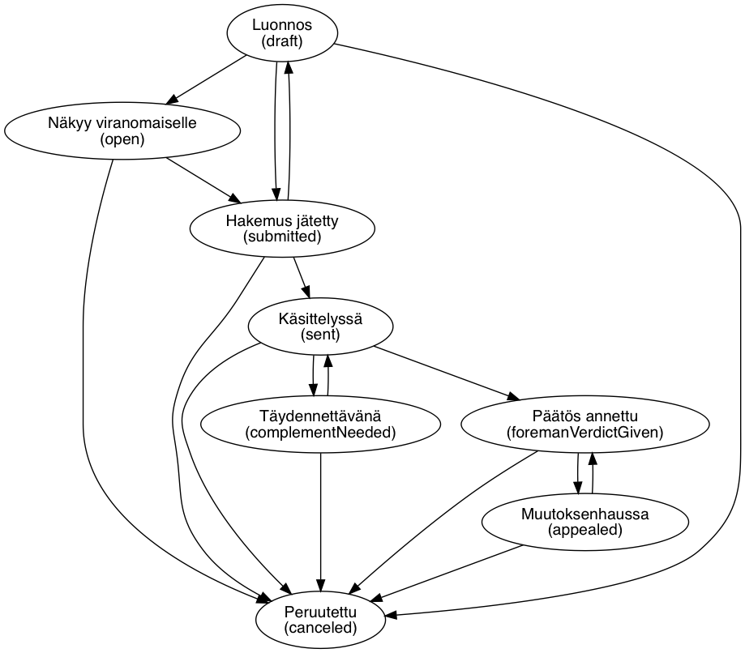
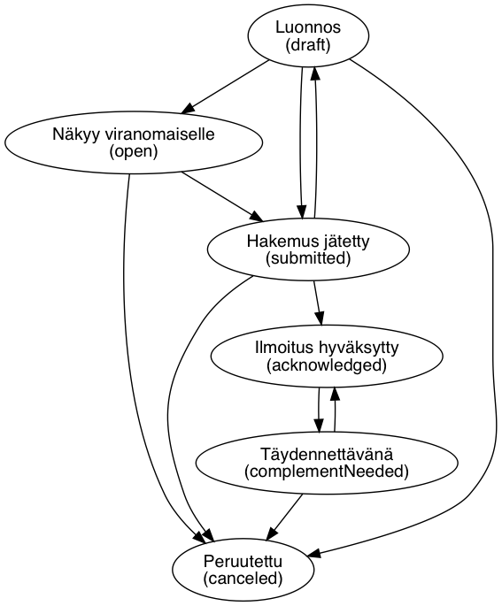
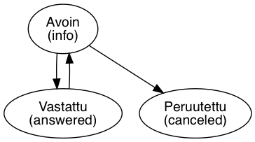

# Tietomalli

Peruskäsitteet on esitetty oheisessa kuvassa.

## Hakemus (application)

Hakija täyttää palvelussa hakemuksen, joka sisältää mm. lomaketietoja ja liitteitä.
Hakemuksella on aina tila (state), joka kuvaa hakemuksen tilaa lupa- tai
ilmoitusprosessissa. Viranomainen tarkastaa ja käsittelee palveluun jätetyn hakemuksen.

Hakemus voi olla joko lupahakemus tai *neuvontapyyntö* (hakemuksella infoRequest=true).
Neuvontapyynnön avulla hakija voi pyytää viranomaiselta neuvoa jo ennen varsinaisen
hakemuksen tekoa. Neuvontapyyntö voidaan muuntaa hakemukseksi, jolloin asioinnin
valmistelun voi aloittaa suoraan neuvontapyynnön pohjalta.

Hakemuksella voi olla yksi *käsittelijä*. Käsittelijä on viranomainen siinä
organisaatiossa, joka on ottanut hakemuksen vastaan.

## Lupatyyppi (permit type)

Lupatyyppi määrittää millaisesta lupa-asioinnista on kyse.
Esimerkiksi rakennusvalvonta, yleiset alueet ja ympäristötoimi ovat omia lupatyyppejään.
Hakemuksen tilakaavio määräytyy lupatyypin perusteella.

Lupatyyppijako perustuu [KuntaGML-skeemajakoon](http://www.paikkatietopalvelu.fi/gml/KuntaGML.html).
Lupatyyppiin liittyy konfiguraatiota, joka ohjaa integraatiota kuntien järjestelmiin.

## Toimenpide (operation)

Toimenpiteet määrittävät hakemuksen tyypin eli millaisia tietoja hakemukseen täytyy täyttää.
Toimenpide kuuluu aina tiettyyn lupatyyppiin. Esimerkiksi toimenpide "Aidan rakentaminen"
kuuluu rakennusvalvonnan lupatyyppiin.

Hakemuksen luontivaiheessa määritelty ensimmäinen toimenpide määrää hakemuksen lupatyypin.
Yhdessä lupatyyppi ja hakemuksen sijaintikunta määrittävät mikä organisaatio käsittelee hakemuksen.

## Hakemuksen tietosisällön määräytyminen

Hakemuksen keskeisintä tietosisältöä ovat lomakkeet (documents) ja liitteet
(attachments).

Dokumentti on periaatteessa mielivaltainen rakenteinen tietue, 
jonka viranomainen on määrittänyt toimitettavaksi tietyn tyyppisten hakemusten yhteydessä. 
Käytännössä dokumentit kuitenkin usein liittyvät kiinteästi johonkin mallinnettuun domainkäsitteeseen, 
kuten käyttäjään (osapuolidokumentit) tai toimenpiteeseen .

Hakemukselle luodaan pohjat vaadittaville tiedoille sen mukaisesti,
mitä toimenpiteitä hakemukseen liittyy.

Organisaatio voi määritellä toimenpidekohtaisesti, mitä liitetyyppejä toimenpiteen
yhteydessä vaaditaan.

Toimenpiteeseen liittyy myös erilaisia lomakkeita, joiden tiedot kuvataan kaikille
organisaatioille yhteisillä skeemoilla (schema). Toimenpiteeseen liittyy aina
täsmälleen yksi päälomake. Lisäksi toimenpiteeseen voi liittyä lomakkeita,
jotka käyttäjä pystyy lisäämään hakemisen aikana.

Koko hanketta koskevat lomakkeet, kuten hakija-, maksaja- ja muiden osapuolien
tiedot, määräytyvät niin ikään toimenpiteen mukaan, mutta tyypillisesti nämä ovat
samat kaikilla lupatyypin toimenpiteillä.

## Organisaatiot

Yllä olevassa kuvassa on hahmoteltu reaalimaailman mallia Lupapisteen käyttöön
ottavista viranomaisorganisaatioista. Lupapisteen kannalta asiakas on jokin kunnan
organisaatio, ei kunta itse. Näiden organisaatioiden nimet vaihtelevat kunnittain,
mutta suurin piirtein vastuualueiden jako on seuraava:

- Rakennusvalvonta, joka vastaa rakentamisen luvista
- Ympäristötoimi, joka vastaa Ympäristöluvista ja maankäytön luvista
- Tekninen toimi, joka vastaa sijoitus- ja kaivuluvista sekä yleisen alueen käytön luvista

Joskus kunnat järjestävät nämä palvelunsa alueellisina. Esimerkiksi Säkylällä,
Euralla ja Köylilöllä yhteinen rakennusvalvonta ja Keski-Uudenmaan ympäristökeskuksella
monen kunnan ympäristötoimi.

Lupapisteen viranomaiskäyttäjät kuuluvat kunnan organisaatioon tai
alueelliseen organisaatioon. Käytännössä on tilanteita, että sama henkilö kuuluu
useampaan organisaatioon. (Esim. kesän ajan tuuraa naapurikunnan viranomaista,
tai joissakin kunnissa, esim. Järvenpäässä yhteispalvelun henkilöstö, joka ottaa
vastaan kaikkien organisaatioiden hakemuksia).

Lupahakemukset osoitetaan aina yhdelle organisaatiolle. Näin voidaan hallita
organisaatiokohtaisia työjonoja. Esim. ympäristölupia ei haluta näkymään
rakennusvalvonnan jonossa. Organisaatiota ei voi vaihtaa hakemuksen luomisen jälkeen.

Tietyn kunnan alueelle kohdistuvia tietyn lupatyypin hakemuksia voi käsitellä
vain yksi organisaatio. Organisaatio voi määritellä, mitä lupatyyppiin liittyviä
toimenpiteitä se käsittelee.

## Käyttäjä

Käyttäjällä on Lupapisteessä perusrooli. Rooli määrittää peruskäyttöoikeustason,
ja roolin mukaan käyttäjälle tarjotaan palvelussa tietty näkymä (oma Single Page Application).

Rooli | Selite
----- | ---
Pääkäyttäjä (admin) | Palvelun hallinnointi
Organisaation pääkäyttäjä (authorityAdmin) | Organisaation pääkäyttäjä hallitsee organisaation tietoja ja konfiguraatioita
Viranomainen (authority) | Viranomainen kuuluu yhteen tai useampaan organisaatioon. Viranomainen voi käsitellä organisaatioon tulleita hakemuksia. Viranomaisrooleja organisaatioihin hallinnoi organisaation pääkäyttäjä
Hakija (applicant) | Vahvasti tunnistautunut hakija. Hakijat voivat luoda hakemuksia palveluun. Hakija voi myös saada valtuutuksia muiden hakijoiden tekemiin hakemuksiin, jolloin samaa hakemusta voi valmistella useampi henkilö
Avoimen neuvontapyynnön viranomaiskäyttäjä (oirAuthority) | Käyttäjä saa ilmoituksia avoimista neuvontapyynnöistä. Käyttäjä voi antaa vastauksen hakijan avoimeen neuvontapyyntön. Käytössä organisaatioissa, jotka eivät vielä ole ottaneet varsinaista asiointia käyttöön.
Dummy (dummy) | Dummy käyttäjä, joka ei ole vielä rekisteröitynyt ja vahvasti tunnistautunut palveluun. Dummy käyttäjä syntyy esimerkiksi kun hakemukselle valtuutetaan käyttäjä, jonka sähköpostiosoite ei ole vielä rekisteröitynyt palvelun käyttäjäksi.

## Käyttäjien oikeudet ja hakemukset

Kun käyttäjä kirjautuu sisään Lupapisteeseen, niin mitkä hakemukset
hän näkee? Hakemuksen näkyvyys määräytyy hakemuksen organization- ja
auth-kenttien perusteella seuraavasti:

Jos käyttäjä on viranomainen samassa organisaatiossa kuin hakemuskin,
niin hakemus näkyy. Tietokannassa tämä tarkoittaa, että käyttäjän
(eli users-collectionin alkion) orgAuthz-kenttä sisältää
ko. organisaation.

Jos hakemuksen auth-kenttä sisältää käyttäjän tiedot, niin ko. käyttäjä näkee
hakemuksen.

Jos käyttäjä on ns. yrityskäyttäjä, niin hän näkee hakemukset joiden
auth-kentässä on yrityksen tiedot.

Mitä käyttäjä sitten voi hakemukselle tehdä riippuu puolestaan käyttäjälle
(joko auth- tai orgAuthz-kentässä) määritellystä roolista.

Hienosäätöä:

- Viranomainen voi kuulua useampaan organisaatioon ja hänellä voi olla samassa
  organisaatiossa useampi rooli.
- Kaikki viranomaiset eivät "orgAuthz-mielessä" kuulu
  organisaatioon. Esimerkiksi lausunnonantajat ja
  vierailijaviranomaiset (nämä ovat viranomaisia, joille "oikeat"
  viranomaiset voivat antaa lukuoikeuden yksittäiselle hankkeelle)
  listataan erikseen organisaation statementGivers-
  guestAuthorities-kentissä. Huomaa, että viranomainen voi olla
  toisessa organisaatiossa esim. lausunnonantaja ja toisessa
  organisaatiossa "oikea" viranomainen. Toisaalta,
  vierailijaviranomaisen ei tarvitse välttämättä olla viranomainen
  (authority) lainkaan.

## Hakemuksen tila

Hakemuksen mahdolliset tilat riippuvat sen päätoimenpiteestä ja onko kyseessä
lupahakemus vai neuvontapyyntö.

Tilat ohjaavat mitä toimintoja hakemukselle voi tehdä. Käsittelyn edetessä osa
hakemuksen tiedoista lukittuu.

Oletustilasiirtymät on kuvattu seuraavassa kaaviossa:

Hanke alkaa Luonnos-tilasta (*draft*), josta se etenee ensimmäisen kommentin
lisäämisen myötä Näkyy viranomaiselle (*open*)-tilaan. Viranomainen näkee luonnokset
työjonollaan, muttei pääse muokkaamaan niitä ennen Näkyy viranomaiselle -tilaa.
Viranomaiskäyttäjien luomat hakemukset syntyvät suoraan Näkyy viranomaiselle -tilaan.

Kun hakija jättää hakemuksen vireille, tilaksi vaihtuu Vireillä (*submitted*).
Valmisteilla ja vireillä olevat hakemukset näkyvät viranomaisella. Vireilletulon
yhteydessä hakemuksesta tallennetaan tietokantaan kopio. Kopiosta muodostetaan
myöhemmin PDF-tuloste, joka lähetetään kunnan taustajärjestelmään.

Kun viranomainen siirtää hakemuksen taustajärjestelmään, tilaksi muuttuu
Käsittelyssä (*sent*). Tässä tilassa hakemusta ei pääsääntöisesti voi muokata
Lupapisteessä. Jos hakemusta on korjattava, hakemukseen voi pyytää täydennyksiä ja
tilaksi vaihtuu Täydennettävä (*complementNeeded*). Kun päätös annetaan, tilaksi
vaihtuu Päätös annettu (*verdictGiven*). Tämän jälkeen hakemuksen voi ilmoittaa
aloitetuksi (Rakennustyöt aloitettu, *constructionStarted*) ja sitten valmiiksi
(Valmistunut, *closed*).

Jos hakemus peruutetaan, sen tilaksi tulee Peruutettu (*canceled*) ja se poistuu
viranomaisen työjonosta. Myös viranomainen voi peruuttaa hakemuksen, jos hän toteaa
että lupahakemus on aiheeton. Viranomaisen on syötettävä Lupapisteeseen peruuttamisen syy.

Työnjohtajan nimeämisissä mahdolliset tilat riippuvat lisäksi siitä, onko kyseessä
hakemus vai ilmoitus.

Neuvontapyynnöillä on kaksi tilaa, avoin ja vastattu. Lisäksi neuvontapyynnön voi peruuttaa.

Jos neuvontapyynnön muuttaa lupahakemukseksi, tilaksi tulee Näkyy viranomaiselle.
